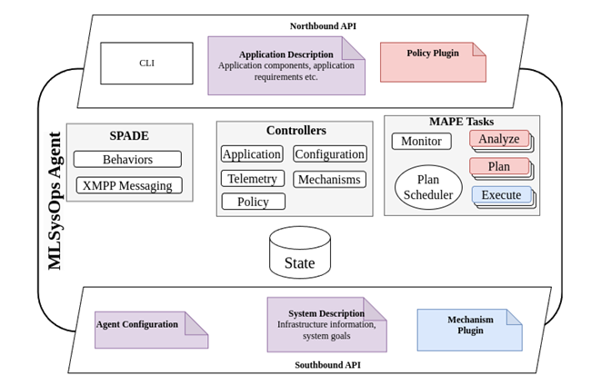
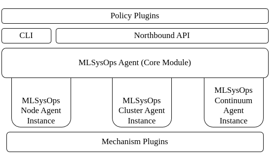

The agent component forms the core of the MLSysOps framework. It provides essential integration logic across all layers,
connecting the configuration mechanisms of the underlying system, telemetry data collected from various system
entities (e.g., application, infrastructure), and system configuration policies. Figure 32 illustrates the high-level
architectural structure of the agent. The component exposes two interfaces—the Northbound and Southbound APIs—which
offer structured methods for different system users to interact with it. The Northbound API targets application and
policy developers, whereas the Southbound API is primarily intended for system administrators and mechanism providers.

The agent follows MAP (Monitor-Analyze-Plan-Execute) paradigm, which was proposed in 2003 [55] to manage autonomic
systems given high-level objectives from the system administrators, by using the same notion for the main configuration
tasks, depicted as MAP Tasks in Figure 32. The programming language of choice is Python, and leverages SPADE Python
multi-agent framework [56] to form a network of agents that can communicate through XMPP protocol and a set of defined
messages, providing any necessary functionality from internal tasks that are called behaviours. To achieve seamless
operation between the various sub-modules, the agent implements a set of controllers that are responsible for managing
the various external and internal interactions.
One important design goal of the agent was extensibility. This goal is achieved by defining simple yet powerful
abstractions for two important actors interacting with the system: on one side, the policy developer, who implements the
core management logic, and on the other side, the mechanism provider, who exposes the available configuration options
for a subsystem. Both abstractions are integrated into the MLSysOps agent as plugin functionalities, specifically named
policy and mechanism plugins. The agent's analysis, planning, and execution tasks depend on this plugin system to
generate intelligent configuration decisions—provided by the installed policy plugins—and to apply those decisions to
the underlying system via the available mechanism plugins.

The agent software is structured into different module types:

- Core Module – Provides foundational functionalities shared by all agent instances (continuum, cluster, and node).
- Layer-Specific Modules – Offer customized implementations specific to the roles of continuum, cluster, or node agents.
- External Interface Modules – Facilitate interactions between the agent framework and external entities. These modules
include the CLI, Northbound API, ML Connector, policy and mechanism plugins.

This modular architecture ensures consistency in core functionalities across all agents, while also supporting
customization and extension for specific layers and external interactions.
