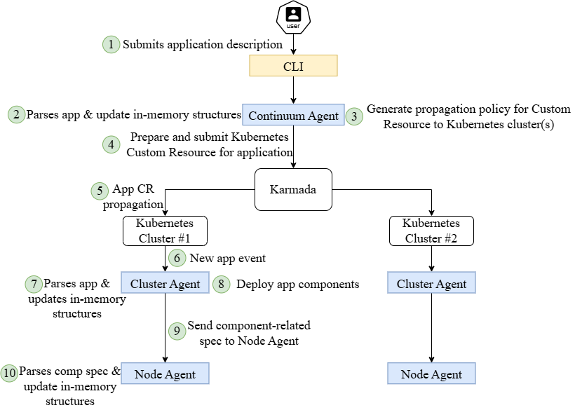

The application owner, one of the main actors, interacts with MLSysOps by submitting the application description using
the Command Line Interface (CLI) provided by the framework. The application description depicts the required deployment
constraints (e.g., node-type, hardware, sensor requirements, etc.), which enable various filtering options for the
continuum and cluster layers, that can decide the candidate clusters and nodes, respectively. Having as an example the
registration of a given application, as shown in Figure 42, we perform a Top-Down propagation of the necessary
information to each layer of the continuum. Initially, the Continuum agent creates a Kubernetes Custom Resource that is
propagated to the available Kubernetes clusters. The Cluster agents follow the Kubernetes Operator pattern, so they are
notified of application creation, update, or removal events. Each Cluster agent manages the components that match its
cluster ID, if any. This information is provided by the Continuum agent in the application's Custom Resource. A given
Cluster agent captures the application creation event, parses the description, and deploys the components based on the
provided requirements. The component specifications are also sent to their host nodes, so that the Node agents can store
relevant fields required for any potential reconfiguration/adaptation.

