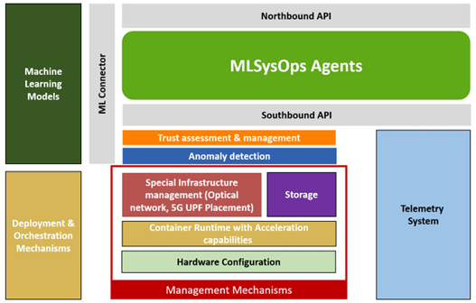
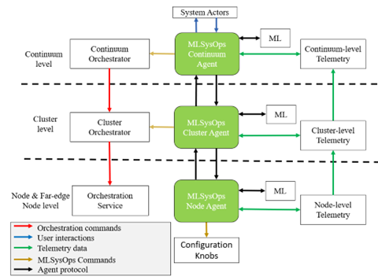

# Architecture

MLSysOps introduces a hierarchical agent-based architecture composed of three levels:
- Node Agents reside on individual nodes and expose configuration interfaces, monitor resource usage, and provide direct
access to telemetry.
- Cluster Agents coordinate groups of nodes, aggregate telemetry, and issue deployment decisions or adaptation
instructions.
- The Continuum Agent sits at the top level, interfacing with external stakeholders (via northbound APIs), receiving
high-level intents and application descriptors, and coordinating decision-making across slices.
Each layer operates a Monitor–Analyze–Plan–Execute (MAPE) control loop, enabling autonomous adaptation based on local
and global telemetry, system optimization targets, and ML-driven policies. Importantly, this architecture separates
management logic from resource control, allowing for modular evolution and system introspection.

The MLSysOps agents, supported by ML models, analyse, predict, and optimize resource usage patterns and overall system
performance by allocating, monitoring and configuring the different resources of the underlying layers via the
mechanisms that are implemented in the context of WP3 and manifested in the current deliverable. This integration is a
collaborative effort that draws on the diverse expertise of project partners, each contributing unique insights and
solutions to the multifaceted challenges of cloud and edge computing. This collaborative approach is complemented by an
iterative development process characterized by continuous testing and feedback loops. Such a process ensures that the
mechanisms developed are not only effective in their current context but are also scalable and adaptable to future
technological advancements and operational needs.

The following figure depicts a comprehensive illustration of the MLSysOps hierarchical agent system's placement
and its interactions with two other fundamental subsystems: container orchestration and telemetry. This agent hierarchy
is structured in line with the orchestration architecture, and it is logically divided into three tiers. The
communication among the three subsystems (agents, container orchestration, and telemetry) is facilitated through
designated interfaces at each tier. Moreover, the agent system engages with the continuum level's system agents and
integrates plug-in configuration policies that can use ML models at all levels. At every level, agents utilize mechanism
plugins to implement commands for adjusting available configuration and execution mode options.

Node-level agents’ interface with local telemetry systems and expose configuration knobs. Cluster-level agents
coordinate resource allocation decisions across groups of nodes. At the top level, the continuum agent handles global
orchestration, provides APIs to external actors, and aggregates telemetry data. ML-driven decisions can be made at every
layer, using information for the respective layer. This layered approach facilitates scalability and separation of
concerns while supporting collaboration across orchestration, telemetry, and ML systems. The agent infrastructure
interacts through three distinct types of interfaces. The Northbound API provides access to application developers and
system administrators. The Southbound API interfaces with the underlying telemetry collection and configuration
mechanisms. The ML Connector allows ML models to be plugged into the framework and invoked for training, prediction, and
explanation tasks.
The telemetry subsystem is built upon the OpenTelemetry specification and is responsible for collecting and processing
metrics, logs, and traces. These are abstracted into hierarchical telemetry streams that feed the decision logic of the
agents and the ML models. Data collection happens at the node level, where individual collectors expose metrics either
in raw or aggregated formats. These are processed through transformation pipelines and propagated to cluster and
continuum levels for higher-level aggregation and analysis.

Application deployment and orchestration are driven by declarative descriptions submitted by application developers and
administrators. These descriptions capture the application's structure, resource requirements, and quality-of-service
objectives. Deployment is handled through standard container orchestration tools, which are extended by the MLSysOps
framework to support advanced placement decisions and runtime adaptation. For far-edge deployments, the framework
introduces a proxy-based architecture involving embServe on constrained devices and a virtual orchestrator service
running inside containerized environments. This approach allows resource-constrained devices to be seamlessly integrated
into the same orchestration and telemetry flows as more capable edge and cloud nodes.

The object storage infrastructure builds upon and extends SkyFlok, a secure and distributed storage system. In MLSysOps,
this infrastructure supports adaptive reconfiguration of bucket policies based on real-time telemetry and application
usage patterns. The storage system exposes telemetry data regarding latency, bandwidth, and access frequency, enabling
agents and ML models to optimize redundancy and placement decisions without disrupting ongoing operations.
The framework also includes specialized subsystems for anomaly detection and trust assessment. These modules analyze
telemetry data to identify attacks or malfunctions and classify anomalies using ML models. Their outputs are exposed
through the telemetry interface and used by higher-level agents to trigger remediation strategies or adapt orchestration
plans. Trust levels for nodes are computed using a combination of identity, behaviour, and capability metrics, forming a
reputation-based model that influences agent decision-making.

ML models play a central role in enabling the autonomic operation of the framework. Each level of the agent hierarchy
may employ one or more models, which are integrated via the ML Connector API. These models receive structured telemetry
input and produce configuration decisions, which are interpreted and enacted by the agents. The framework supports
reinforcement learning, continual learning, and federated learning scenarios. In addition, explainability mechanisms are
integrated into the ML workflows to allow system administrators and application developers to understand and audit the
decisions made by the models.

MLSysOps effectively manages operations by leveraging telemetry data collected from each level, which provides essential
insights. This data, combined with machine learning models, enhances the decision-making process, aligning with both the
application's objectives and the system's requirements. Actions based on these decisions are cascaded and refined from
the top level downwards. The final status and outcomes of these decisions are then made accessible to system Actors. The
design and functionality of the telemetry system are further explaiend in [Telemetry system design](design/telemetry).
