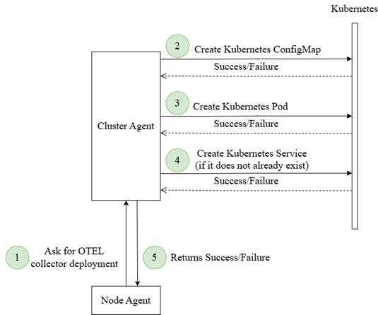

Controllers are responsible for coordinating all internal components of the framework, including the MAPE tasks, SPADE,
Policy and Mechanism Plugins, and the Northbound and Southbound APIs.

- **Application Controller**: Manages the lifecycle of the Analyze loop for each application submitted to the system. When a
new application is submitted, a corresponding Analyze behaviour is initiated, and it is terminated when the application
is removed.

- **Policy & Mechanism Plugin Controllers**: Responsible for loading, initializing, and configuring policy and mechanism
plugins. During runtime, these controllers provide updated information to the Application Controller, reflecting any
changes in the policy API files.

- **Agent Configuration Controller**: Handles external configuration commands received from other agents or via the Northbound
API, and propagates them to the appropriate internal components. It is also responsible for loading the initial
configuration file during startup.

- **Telemetry Controller**: Manages the OpenTelemetry Collector for each agent, including initial deployment and runtime
configuration. Since each collector operates as a pod within the cluster, the Node Agent coordinates with the Cluster
Agent to request deployment and updates, as depicted in Figure 41. Additionally, this controller configures the Monitor
task based on the telemetry metrics being collected.

