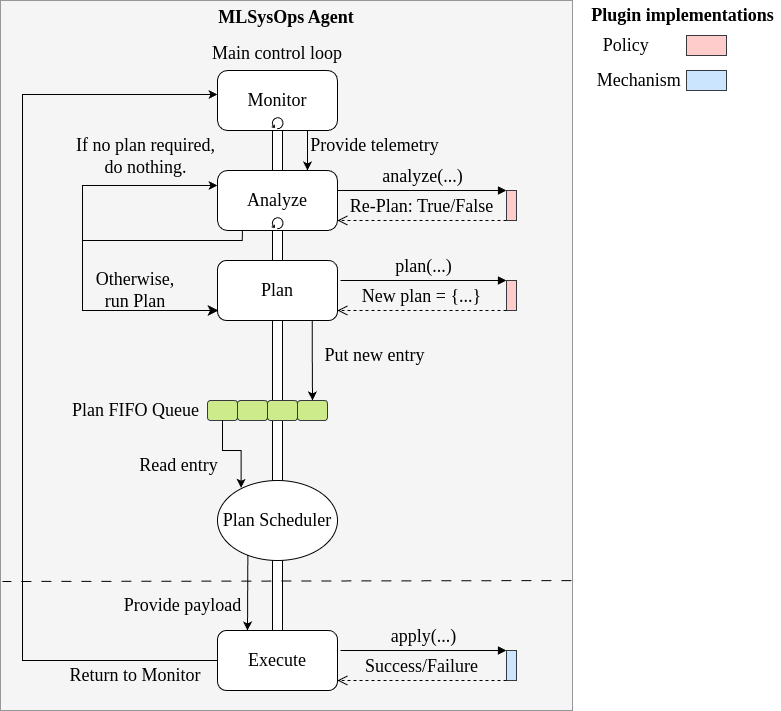

# MLSysOps Plugin System

The MLSysOps framework provides a structured plugin mechanism that enables a modular approach to integrating
configuration decision logic with arbitrary mechanisms. Plugins are categorized into two types: core and custom. Core
plugins are always enabled and are used by MLSysOps to perform essential management functions. In contrast, custom
plugins can be configured and activated either during installation or at runtime, allowing flexibility and extensibility
based on system requirements.

Core plugins provide essential policies and mechanisms. The following table briefly describes the initial plugins that
have been developed, up to the time of writing of this document

## Execution Flow

Figure X illustrates the execution flow of the MAP tasks and the integration of both policy and mechanism plugins. The
Monitor task runs periodically at all times, regardless of whether an application has been submitted, collecting
telemetry data and updating the local state. When a new application is submitted to the system, a separate Analyze task
thread is launched, which uses the analyze method of the corresponding policy plugin. Based on the result, the analysis
session either terminates or triggers a background Plan task.

The Plan task then invokes the policy plugin’s plan method to generate a new configuration plan. If a valid plan is
produced, it is pushed into a FIFO queue. The Plan Scheduler periodically processes the plans in the queue and initiates
an Execute task for each mechanism included in the output of the policy plugin’s plan method. The Plan Scheduler
enforces a constraint that prevents two different plans from applying configuration changes to the same mechanism within
the same scheduling cycle.

Finally, the Execute task for each mechanism calls the apply method of the corresponding mechanism plugin. The results
of the configuration are made visible to the next execution of the Analyze task, either via direct status retrieval or
through the telemetry stream.

## Plugin Inventory

| Policy Name                              | Functionality                                                                            | Type   | Continuum Layer |
|------------------------------------------|------------------------------------------------------------------------------------------|--------|-----------------|
| Static Placed Components                 | It places specific components on a node.                                                 | Core   | Cluster         |                 
| Dynamic Placed Components                | Places application components on a node, based on application description criteria.      | Core   | Cluster         |                 
| Cluster Component Placement              | Places application components in a cluster, based on application description criteria.   | Core   | Cluster         |                
| Smart Agriculture Drone Management       | Decides on the usage of a drone in a field.                                              | Custom | Cluster         |                 
| Smart Agriculture Application Prediction | It predicts the application performance of smart agriculture. Does not produce any plan. | Custom | Node            |                 
| Smart City Noise Prediction              | Predicts the existence of people, using sound sensors. Does not produce any plan.        | Custom | Node            |                 
| Smart City Cluster Management            | Based on the node-level prediction metrics, it configures the application deployment.    | Custom | Cluster         |                 
| CC Storage Gateway Placement             | Decindes on the CC storage gateway container.                                            | Custom | Cluster         |        

| Mechanism Plugin Name        | Functionality                                                              | Type   | Continuum Layer | 
|------------------------------|----------------------------------------------------------------------------|--------|-----------------|
| Fluidity                     | It manages application component placement in a Kubernetes cluster         | Core   | Cluster         |
| ContinnumComponent Placement | It places the components to specific clusters.                             | Core   | Continuum       | 
| CPUFrequency                 | It configures the CPU frequency for the supported architectures.           | Core   | Node            |
| NVIDAGPUFrequency            | It configures the GPU Frequency for the supported architectures.           | Core   | Node            | 
| FPGAConfigurator             | It configures the active bitrstream of Xilinx MPSoC FPGA.                  | Core   | Node            |
| vAccelPlugin                 | Configures the vAccel plugin used by a component.                          | Core   | Node            |
| CCStorage                    | Configures the storage policy of a storage gateway.                        | Custom | Cluster         |
| NetworkRedirection           | Configures the network interfaces that are used by application components. | Custom | Cluster         | 
| ChangePodSpec                | It configures the pod specifications for specific values.                  | Core   | Node, Cluster   |

