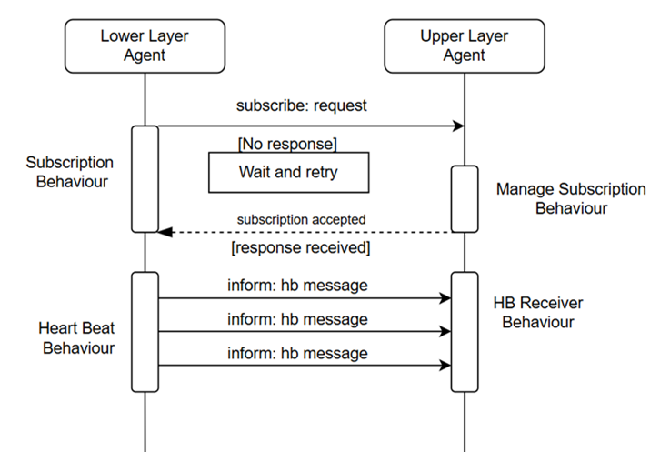

# SPADE

SPADE (Smart Python Development Environment) [56] is a middleware platform for multi-agent systems written in Python,
leveraging the capabilities of instant messaging to manage communication between agents. It simplifies the development
of intelligent agents by combining a robust platform connection mechanism with an internal message dispatcher that
efficiently routes messages to various integrated behaviours. Each agent in SPADE is identified by a unique Jabber ID (
JID) and connects to an XMPP server using valid credentials. The use of XMPP not only provides persistent connections
and reliable message delivery but also enables real-time presence notifications, which are essential for determining the
availability of agents in a dynamic environment.
The selection of SPADE as the middleware for our multi-agent system is based on several key factors. Its native Python
implementation allows for seamless integration with machine learning libraries and other smart applications, ensuring
that sophisticated functionalities can be embedded directly within the agents. SPADE adheres to the FIPA standards,
promoting interoperability with other agent platforms such as JADE, which is crucial for systems requiring diverse
communication protocols. Furthermore, its modular architecture and open-source nature foster a vibrant community for
continuous improvement, supporting extensibility through plugins, and custom behaviours. This robust, flexible design
not only accelerates the development cycle but also provides a reliable foundation for building complex, intelligent
multi-agent systems.

## Behaviours

In SPADE, a behaviour is a modular piece of functionality that encapsulates a specific task or activity for an agent.
Behaviours determine how an agent reacts to incoming messages, processes information, or interacts with its environment.
They can operate in different modes:

- Cyclic and Periodic behaviours are useful for performing repetitive tasks.
- One-Shot and Time-Out behaviours can be used to perform casual tasks or initialization tasks.
- The Finite State Machine allows more complex behaviours to be built.

This flexible structure allows us to efficiently delegate tasks without overcomplicating the agent’s core logic,
ensuring clean and maintainable design.
Within our multi-agent system, each agent is assigned specific behaviours based on its role and the tasks it needs to
perform. Each type of agent includes unique behaviours that enable it to carry out specialized tasks. For example, the
Continuum Agent is responsible for interacting with both other agents and the user, incorporating behaviours for
processing user requests, such as responding to a ping message to confirm aliveness, processing application and ML model
descriptions, and checking the deployment status of these applications or models. And other behaviours to process
agent’s interactions that are also common functionalities across the agents, for example handling subscriptions and
heartbeat messages.

As previously mentioned, agents are structured across three layers: Node Agents, Cluster Agents, and a central Continuum
Agent. Each type of agent is assigned a specific set of behaviours that align with its role in the system. These
behaviours enable the agents to communicate, monitor health, process application logic, and adapt to runtime conditions.
Below is a detailed explanation of each behaviour, followed by a description of which agent types implement them.

- Heartbeat Behaviour: This behaviour is used by node and cluster agents and is responsible for periodically sending a
  signal that indicates the agent is alive. These heartbeat messages are used by higher-layer agents to maintain an
  up-to-date view of active agents in the system.
- Subscribe Behaviour: Used by Node and Cluster Agents, this behaviour sends a subscription request to a higher-layer
  agent. It allows the agent to join the hierarchical structure and start reporting to its parent, establishing the
  control flow across layers.
- Message Receiving Behaviour: Present in all agent types, this behaviour allows an agent to handle incoming messages
  from other agents. These messages may contain commands, data updates, or coordination requests. It is essential for
  asynchronous interaction across the distributed system.
- Message Sending Behaviour: Also implemented by all agent types, this behaviour handles sending messages to other
  agents. It enables agents to initiate communication, send results, or trigger actions elsewhere in the system.
- Management Mode Behaviour: This behaviour allows agents to switch between different decision-making strategies. It is
  present across all agents and can dynamically toggle between heuristic control and machine learning-based approaches.
  This flexibility allows the system to adjust its intelligence level based on runtime context or user commands.
- Policy & Mechanism Plugin Management Behaviour: Implemented by all agents, this behaviour allows enabling or disabling
  plugins at runtime. It supports dynamic reconfiguration of agent logic and enhances adaptability without requiring
  redeployment.
- HB Receiver Behaviour: This behaviour is used in Cluster and Continuum Agents. It receives heartbeat signals sent by
  lower-layer agents (e.g., Nodes), updates their status, and maintains a local registry of active agents.
- Check Inactive Agents Behaviour: This behaviour complements the heartbeat mechanism. It is used in Cluster and
  Continuum Agents to scan the list of subscribed agents and identify those that have stopped sending heartbeats,
  indicating failure or disconnection.
- Manage Subscription Behaviour: Implemented by Cluster and Continuum Agents, this behaviour accepts and registers
  agents from a lower layer. It enables agents to expand their scope of management as new agents come online and request
  to be part of the system.
- API Ping Behaviour: Exclusive to the Continuum Agent, this behaviour allows external components such as the
  command-line interface to verify whether the agent is alive by sending ping messages through the North Bound API.
- Check App Deployment Behaviour: This behaviour is also unique to the Continuum Agent. It verifies that the components
  of an application have been properly deployed in the framework. It ensures application consistency across the
  infrastructure.
- Check ML Deployment Behaviour: Like the previous behaviour but focused on machine learning applications. It verifies
  that ML services are correctly deployed and ready for operation. This behaviour also exists only in the Continuum
  Agent.
- App Process Behaviour: Implemented in the Continuum Agent, this behaviour analyzes the application description and
  determines how and where to deploy its components. It interprets application specifications and translates them into
  deployment strategies.
- ML Process Behaviour: This behaviour, also integrated into the Continuum Agent, is responsible for managing the full
  lifecycle of machine learning endpoint deployments. It handles the deployment of new ML models or services, monitors
  the status of deployed models in real-time, supports redeployment in case of model updates or infrastructure changes,
  and manages the deletion of endpoints when they are no longer needed. This ensures a consistent and automated approach
  to maintaining ML services across the continuum infrastructure.

Each of these behaviours is designed to work in harmony within its respective agent, ensuring that the system remains
modular, scalable, and responsive to dynamic environments. As we continue to develop our framework, we can further
refine each behaviour to meet the specific requirements of our agents and enhance the overall efficiency of the
multi-agent system.

| Behaviour Name        | Type     | **Type of Agent** |         |      |
|-----------------------|----------|:-----------------:|:-------:|:----:|
|                       |          |     Continuum     | Cluster | Node |
| API Ping              | Cyclic   |         x         |         |      |
| Check inactive        | Periodic |         x         |    x    |      |
| Check _app_deployment | One Shot |         x         |         |      |
| Check_ml_deployment   | One Shot |         x         |         |      |
| HB Receiver           | Cyclic   |         x         |    x    |      |
| HeartBeat             | Periodic |                   |    x    |  x   |
| ML_process            | Cyclic   |         x         |         |      |
| Manage Subscription   | Cyclic   |         x         |    x    |      |
| Management mode       | Cyclic   |         x         |    x    |  x   |
| Message receiving     | Cyclic   |         x         |    x    |  x   |
| Message sending       | One Shot |         x         |    x    |  x   |
| Process               | Cyclic   |         x         |         |      |
| Subscribe             | Cyclic   |                   |    x    |  x   |
| Policy management     | Cyclic   |         x         |    x    |  x   |

## Messages

SPADE agents communicate by exchanging discrete messages rather than direct method calls, embodying the “computing as
interaction” paradigm of multi-agent systems. As previously mentioned, each agent is identified by a unique ID (JID) (
username@domain) and connects to an XMPP server using this ID and a password. SPADE relies on the XMPP (Extensible
Messaging and Presence Protocol) as the backbone for all inter-agent communication. This means that every message an
agent sends is transmitted as an XMPP message stanza through the server to the target agent. By using XMPP’s standard
messaging infrastructure, SPADE ensures that agents can reliably send and receive messages in real time, even across
different hosts or network environments. In essence, the XMPP server mediates the exchange, routing each message to the
intended recipient agent (identified by its JID) whether the agents reside on the same machine or are distributed over
the Internet. This decoupled, server-mediated communication model provides a robust and standardized way for agents to
interact, leveraging XMPP’s features for authentication, presence, and security (e.g. encryption) built into the
protocol.
For this XMPP server, the open-source ejabberd service was selected due to its superior scalability, reliability,
performance, security, ease of integration with SPADE, and strong community support. The configuration of the service is
made on the config file providing a domain and each agent can register into it by using a jabber id and a password. Once
the agent is registered it is ready to start exchanging messages with other registered agents.

### Message Dispatching and Templates

Within each SPADE agent, an internal message dispatcher handles incoming and outgoing messages. This dispatcher
functions like a mail sorter: when a message arrives for the agent, the dispatcher automatically places it into the
proper “mailbox” for handling, and when the agent sends a message, the dispatcher injects it into the XMPP communication
stream. The key to this routing is the use of message templates. Each behaviour (task) running within an agent can be
associated with a message template that defines the criteria for messages it is interested in. A template can specify
fields such as the sender’s JID, the message’s content or subject, thread/conversation ID, or metadata like performative
and ontology. When an agent receives a message, the dispatcher compares the message against the templates of all active
behaviours and delivers the message to the behaviour whose template it matches. In this way, templates act as filters to
ensure each behaviour only processes relevant messages. For example, a template might match messages with a particular
sender and a specific performative type, so that only messages from that sender with that communicative intent will
trigger the associated behaviour. Messages that meet the template conditions are queued in the target behaviour’s
mailbox, where the behaviour can retrieve them asynchronously. This template-based filtering and routing mechanism
allows multiple behaviours to run concurrently in an agent without interfering with each other, as each behaviour will
only pick up the messages meant for it. It provides a structured approach to message handling, simplifying the
development of complex interactions (such as protocol exchanges) by separating them into different behaviour handlers
listening for different message patterns.

### FIPA Standards for Structured Communication

SPADE’s messaging model also draws from established standards to ensure that communications are well-structured and
interoperable. In particular, SPADE supports message formats inspired by the FIPA (Foundation for Intelligent Physical
Agents) Agent Communication Language standards. FIPA defines a set of message fields and interaction protocols intended
to promote clear semantics and compatibility among agents. In SPADE, each message’s metadata can include standard
FIPA-ACL fields like the performative (which describes the intent of the message, such as “inform” or “request”), the
ontology (which defines the domain of discourse or vocabulary of the message content), and the language (the format of
the message content). By allowing these fields in the message structure, SPADE ensures that every message carries not
just raw data but also contextual information about how to interpret that data. Adhering to FIPA communication standards
means that SPADE agents follow a common protocol syntax and semantics, which in principle makes it easier for them to
interact with agents from other FIPA-compliant platforms. In other words, the use of well-defined performatives and
message fields imposes a consistent structure on messages, reducing ambiguity and enhancing interoperability. This
standards-based approach to message handling helps achieve a level of consistency in agent communication, so that the
intent and context of messages are understood in a uniform way across different agents and systems. Ultimately, SPADE’s
alignment with FIPA standards reinforces structured agent interactions and lays the groundwork for integration with the
broader multi-agent ecosystem where such standards are followed.

## Interactions – Coordination

Agents rely on behavioural logic and message exchanges to interact and coordinate tasks across the layers of the
continuum. Below is an example illustrating how subscription and heartbeat mechanisms are implemented using agent
behaviours to facilitate this interaction.

### Subscription and Heartbeat Messages

Subscription and heartbeat messages are essential processes used to register available nodes within the continuum and to
maintain up-to-date information about the status of nodes and agents across the entire system.

In the subscription process, a lower-layer agent sends a subscription request using the subscribe performative to an
upper-layer agent. Since the behaviour is cyclic, the lower-layer agent continues to send subscription requests until it
receives a subscription accepted message from the upper-layer agent. Once the acknowledgment is received, the agent
stops the cyclic subscription behaviour and initiates the periodic heartbeat behaviour.

During the heartbeat phase, the lower-layer agent periodically sends heartbeat (HB) messages using the inform
performative. The upper-layer agent, which runs a heartbeat receiver behaviour, constantly listens for these messages
and updates its records based on the latest HB information.

As shown in Figure above, the interaction between agents through message exchanges and behaviour logic enables the
coordinated execution of various tasks across the continuum. In this example, the focus is on the subscription and
heartbeat process. These coordinated mechanisms allow agents to collaborate and support broader functionalities within
the framework, 