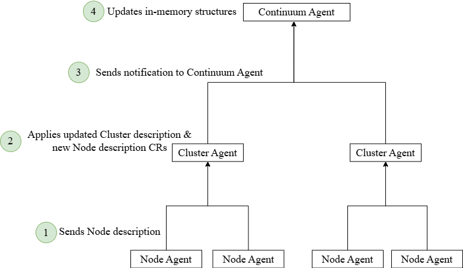

The infrastructure descriptions must be provided during the agent installation process. Taking the example of a Node
description registration, it is propagated to the framework using a Bottom-Up approach, in contrast to the application
registration solution (Top-Down), as shown in Figure 43. To this end, we follow the usual node registration protocols,
e.g., node registration to a Kubernetes cluster. In our case, the Node agent sends the respective description to the
Cluster agent, which transforms it into a Custom Resource and applies it to Kubernetes. In addition, the Cluster agent
updates the Cluster formal description (also defined as a Custom Resource) with high-level information that can be used
by the Continuum agent in order to perform filtering based on the available sensors, accelerators, and node types (e.g.,
to meet any relevant application deployment constraints). Finally, the Cluster agent notifies the Continuum agent, via
the agent protocol, so that the latter can update its Cluster-related structures.

