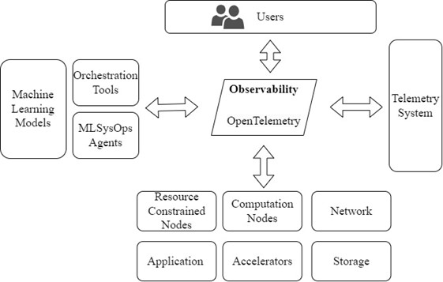
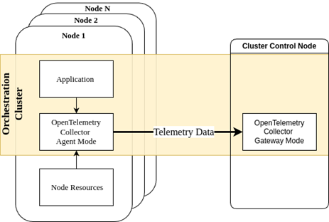
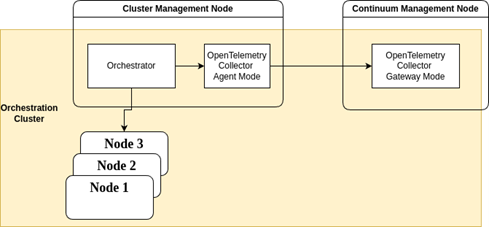
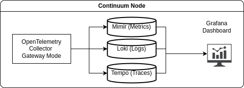

# Telemetry System

The telemetry plane of MLSysOps collects the data necessary from all layers to drive the
configuration decisions, potentially made using ML inference and continual training, with appropriate aggregation and
abstraction towards the higher layers of the hierarchy. This section will give the technical insights of the MLSysOps
telemetry system that supports the collection of performance metrics across MLSysOps resource management layers.

## OpenTelemetry Specification

The MLSysOps framework operates on different layers of the cloud-edge-far-edge continuum and manages highly
heterogeneous systems and applications while simultaneously providing appropriate observability user interfaces, as
illustrated in Figure 5. Given the diversity of tools and vendors involved, a vendor- and tool-agnostic protocol for
collecting and transmitting telemetry data is essential.

[OpenTelemetry](https://opentelemetry.io), a well-defined open-source system, provides the foundation for MLSysOps
observability capabilities.
OpenTelemetry is an all-around observability framework, that handles all necessary signals (categories of telemetry
data), such as traces, metrics, and logs. MLSysOps supports and uses all three signal categories. The basic signal that
is exposed to the framework’s users are metrics, whereas logs and traces are used for debugging and profiling purposes.

OpenTelemetry offers the API as well as the software components that implement various telemetry functionalities, in the
form of a Software Development Kit (SDK).

The central software component is the OpenTelemetry Collector (OTEL Collector), a vendor-agnostic implementation of the
telemetry pipeline (as presented in Figure 6) that consists of three stages: i) receive, ii) process, and iii) export.
This component is versatile and flexible, being able to receive telemetry data in multiple formats, process them in
different ways, and export them to other systems. The OTEL Collectors can operate in two different modes: i) Agent and
ii) Gateway mode. The main difference is that in Gateway mode, the collector receives telemetry data from other
collectors (that, in turn, operate in Agent or Gateway mode). This makes the gateway a centralized aggregator for any
underlying OTEL collectors.

The OTEL Collector [4] baseline implementation offers the minimum required functionality, which is a set of receivers
and exporters that communicate using data conforming to the OpenTelemetry Data Specification, using either HTTP or gRPC
protocols, as well as specific processing capabilities, like batching and memory control. The OpenTelemetry collector
repository [4] includes multiple plugin implementations for all three stages of the telemetry pipeline, like Prometheus
receivers & exporters, as well as a routing processor that can create different telemetry streams in the OTEL Collector
pipeline. In MLSysOps, we fully leverage the available plugins to achieve the desired functionality for the OTEL
Collectors at each level of the MLSysOps hierarchy: node, cluster, and continuum.

The OpenTelemetry specification defines a way to collect and transfer telemetry data without making any assumptions
about the storage of the data. MLSysOps follows the same paradigm and does not make any assumptions for this matter,
although, for the development of the framework, we use the Mimir metrics database [5], which is an open-source software
that is suitable for the needs of our telemetry system. Mimir is deployed at the highest level (continuum), storing
telemetry data and offering an API for flexible telemetry data querying through its proprietary PromQL interface,.
PromQL [6] is quite versatile and powerful for time-series data, allowing different clients (such as ML models) to
easily consume the data they need, using further aggregation and transformation functions. On top of the Mimir database,
MLSysOps uses Grafana [7] for data visualization, Loki [8] for the logs messages database, and Grafana Tempo [9] for
trace storage. All these components belong to the same ecosystem and work seamlessly with each other without a need for
further configuration. We leverage the PromQL for the MLSysOps Telemetry API at the higher levels, implementing the
necessary functionality for providing telemetry data to other entities of the system, and the Prometheus metric format
for providing telemetry data at the same level.

The deployment of the OTEL Collectors in each node is performed using the appropriate containers, and the orchestration
is done through the same orchestrator as the ones used for application components. This simplifies the management and
the connectivity between the application components and the OTEL Collectors. The deployment configuration is done
transparently and automatically by the MLSysOps framework, which is responsible for the initial deployment and
configuration of the OTEL Collector pods on every node and layer, as well as the dynamic reconfiguration of the
collectors at runtime.

## Node Level Telemetry

On each node, the OTEL Collector operates in Agent mode. As Figure 7 illustrates, it receives data from any entity that
needs to emit telemetry data into the telemetry system. This is done either through the available interfaces, as they
are discussed in Section 2.7, or through the appropriate configuration of the OTEL Collector enabling the desired
receiver. It then periodically pushes telemetry data to the OTEL Collector, which operates in Gateway mode at the
cluster level. OTEL Collectors in each node can process the data in batches, keeping the overhead low. For instance, for
an application component sending telemetry data at a high rate, the collector agent can store the data in memory (
perhaps even process them to perform filtering and aggregation; see next) and then forward it to the gateway at a lower
rate.
It is also possible to apply transformations and aggregations to the raw data before forwarding them to the gateway
collector. Note that the OTEL Collector at the node level can route the raw and the transformed telemetry data to
different exporters. The raw data exporting route, provides an endpoint that can be queried locally.

## Cluster Level Telemetry

At the cluster level, different components need to be monitored. The telemetry data in this layer must describe the
status of the cluster rather than of a specific node. The main source of information for this level is the orchestration
manager. There is, therefore, a dedicated OTEL Collector configured to collect metrics from the orchestrator.

## Continuum Level Telemetry

At the highest level of the MLSysOps framework, telemetry data is used not only for configuration decisions but also for
informational and debugging purposes. This layer also includes components for telemetry data storage and visualization.

