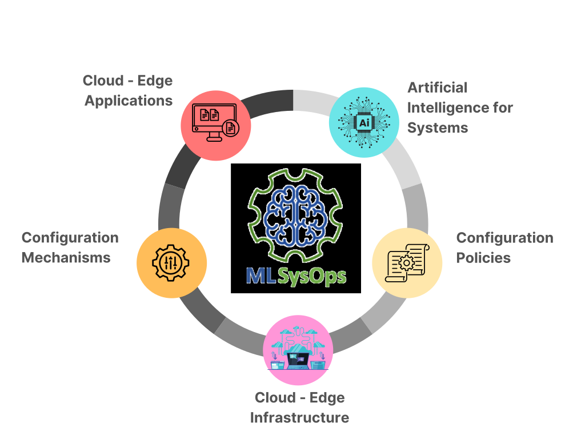
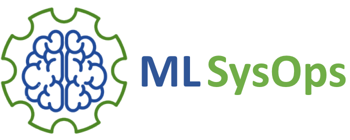

# MLSysOps Framework

The MLSysOps framework operates in the context of a heterogeneous, multi-layered computing continuum, ranging from 
centralized cloud infrastructures to resource-constrained far-edge devices. The objective of the framework is to enable
autonomic, explainable, and adaptive system management by leveraging artificial intelligence, with minimal human intervention.

The design of MLSysOps is guided by a system model that introduces the concept of a slice — a logical grouping of computing,
networking, and storage resources across the continuum that is managed as a unit. Each slice is governed by its own 
deployment of the MLSysOps control plane and encompasses physical or virtualized resources at different layers.

In essence, the framework operates as an abstraction middleware between the participating entities.

## Key features

* Kubernetes deployment management.
* Multi-cluster management using Karmada.
* Dynamically configured telemetry system.
* Plugin systems for configuration policies and mechanisms.
* Application deployment model, using Kubernetes Custom Resource Definitions (CRDs).
* System infrastructure inventory, using Kubernetes Custom Resource Definition (CRDs).
* REST API endpoints (Northbound API service). It can be used by a proprietary CLI.
* ML Connector service, for easy ML Model management, deployment, retraining, and explainability.
* Node level management.
* Deploy using different container runtimes. 
* Resource constrained devices management (Far-Edge devices).
* Storage service managed by the framework.

## Use cases

* Optimize the deployment of an application in a continuum system slice, using smart policies, that can make use of ML models.
  * Achieve application targets, specified in the application deployment description.
  * Optimize system targets, based on system descriptions.
* Implement arbitrary configuration mechanisms, and expose them to configuration policies.

## Current support

| Feature                           | Status             | Stability  |  |
|-----------------------------------|--------------------|------------|--|
| Kubernetes Management             | :heavy_check_mark: | Alpha      |  |
| Multi-cluster deployment          | :heavy_check_mark: | Alpha      |  |
| Multi-cluster networking          | :x:                | -          |  |
| Dynamic telemetry system          | :heavy_check_mark: | Alpha      |  |
| Plugin system                     | :heavy_check_mark: | Alpha      |  |
| Application & System descriptions | :heavy_check_mark: | Alpha      |  |
| Basic ML management               | :heavy_check_mark: | Alpha      |  |
| Node level management             | :x:                | -          |  |
| Far-edge devices                  | :x:                | -          |  |
| Managed Storage service           | :x:                | -          |  |

**Mechanism Plugins**

| Plugin Name | Description                                                     | Configuration options               |
|-------------|-----------------------------------------------------------------|-------------------------------------|
| Fluidity    | Provides the capability to manage Kubernetes pods and services. | * Deploy/remove/relocate components |
|             |                                                                 |                                     |

**Policy Plugins**

| Plugin Name            | Description                                | 
|------------------------|--------------------------------------------|
| staticPlacedComponents | It provides the logic to place components. |
|                        |                                            |

## Quick links

- [Contributing](developer-guide/contribute/)
- [Website](https://mlsysops.eu)

---
## Acknowledgements

