# MLConnector step-by-step guide and example

**Base URL:** `BASE_URL`

---

# Model Endpoints
## Model Registration
Model registration is a two step process. In the initial step, we add the model metadata using json description defined below. For example, model type, hyperparameter, modeltags and other features. The second step involve adding the model artifacts; .pkl file, training data, requirements file and python script that will be used to retrain the model (See example). 
### POST /model/add
**Summary:** Add new ML model metadata.

**Request Body (`MLModelCreate`):**
```json
{
  "modelname": "RandomForest",
  "modelkind": "classification",
  "drift_detection": [
    { "is_true": 0, "method": 0 }
  ]
  // other fields (see endpoint): hyperparameter, modelperformance, trainingresource, runresource, featurelist, inference, modeltags
}
```

**Responses:**
- **201**: Created `MLModel` object.
- **422**: `HTTPValidationError`.

**Example cURL:**
```bash
curl -X POST "BASE_URL/model/add" \
     -H "Content-Type: application/json" \
     -d '{
           "modelname": "MyModel",
           "modelkind": "regression",
           "drift_detection": [{"is_true": 1, "method": 2}]
         }'
```

**Example Python:**
```python
import requests

payload = {
    "modelname": "MyModel",
    "modelkind": "regression",
    "drift_detection": [{"is_true": 1, "method": 2}]
}
resp = requests.post("BASE_URL/model/add", json=payload)
print(resp.json())
```

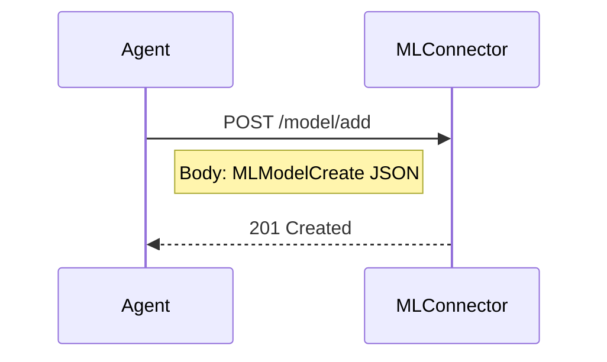

---

### POST /model/{model_id}/upload
**Summary:** Upload a file for a specific model.

**Path Parameters:**

| Name     | In   | Type   | Required | Description    |
|----------|------|--------|----------|----------------|
| model_id | path | string | yes      | ID of the model |

**Request Body (multipart/form-data):**
- `file` (binary)
- `file_kind`: `model` | `data` | `code`

**Responses:**
- **201**: `FileSchema` object.
- **422**: `HTTPValidationError`.

**Example cURL:**
```bash
curl -X POST "BASE_URL/model/1234/upload" \
     -F "file=@/path/to/model.pkl" \
     -F "file_kind=model"
```

**Example Python:**
```python
import requests

files = {
    "file": open("model.pkl", "rb"),
    "file_kind": (None, "model")
}
resp = requests.post("BASE_URL/model/1234/upload", files=files)
print(resp.json())
```

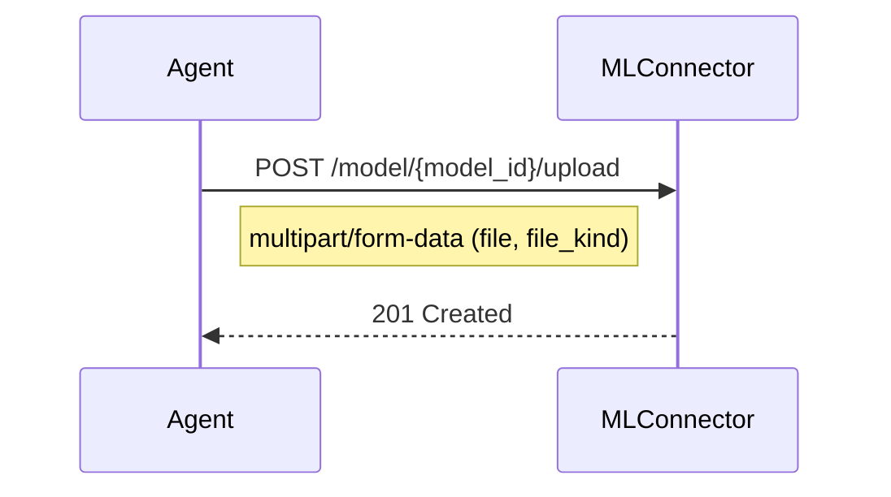

---

### GET /model/all
**Summary:** Get all ML models.

**Query Parameters:**

| Name  | In    | Type    | Default | Required | Description                 |
|-------|-------|---------|---------|----------|-----------------------------|
| skip  | query | integer | 0       | no       | Number of items to skip     |
| limit | query | integer | 100     | no       | Maximum number of items     |

**Responses:**
- **200**: Array of `MLModel` objects.
- **422**: `HTTPValidationError`.

**Example cURL:**
```bash
curl -X GET "BASE_URL/model/all?skip=0&limit=50" \
     -H "Accept: application/json"
```

**Example Python:**
```python
import requests

resp = requests.get(
    "BASE_URL/model/all",
    params={"skip": 0, "limit": 50}
)
print(resp.json())
```

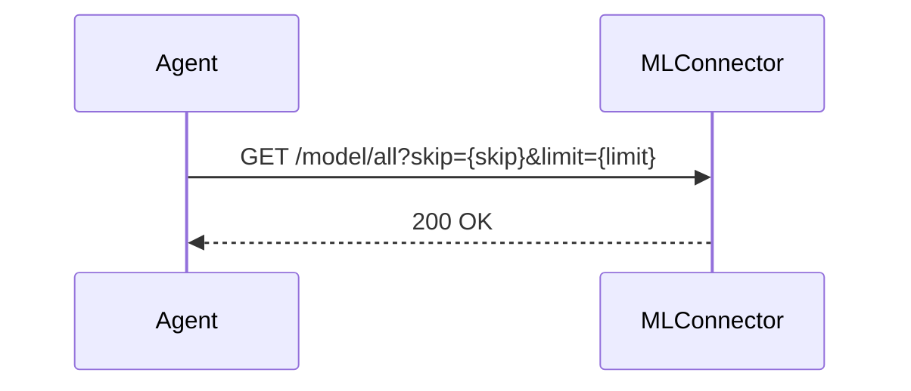

---

### GET /model/getkind/{modelkind}
**Summary:** Get models by kind.

**Path Parameters:**

| Name      | In   | Type   | Required | Description                        |
|-----------|------|--------|----------|------------------------------------|
| modelkind | path | string | yes      | `classification`, `regression`, or `clustering` |

**Responses:**
- **200**: Array of `MLModel` objects.
- **422**: `HTTPValidationError`.

**Example cURL:**
```bash
curl -X GET "BASE_URL/model/getkind/regression" \
     -H "Accept: application/json"
```

**Example Python:**
```python
import requests

kind = "regression"
resp = requests.get(f"BASE_URL/model/getkind/{kind}")
print(resp.json())
```

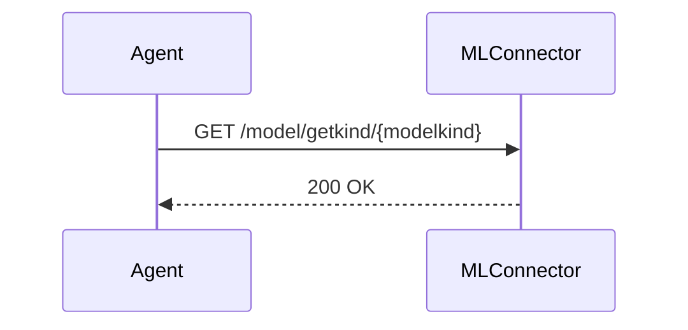

---

### GET /model/search
**Summary:** Get models by tags.

**Query Parameters:**

| Name | In    | Type             | Required | Description                     |
|------|-------|------------------|----------|---------------------------------|
| tags | query | array of strings | no       | e.g. `?tags=fast&tags=tree-based` |

**Responses:**
- **200**: Array of `MLModel` objects.
- **422**: `HTTPValidationError`.

**Example cURL:**
```bash
curl -G "BASE_URL/model/search" \
     --data-urlencode "tags=fast" \
     --data-urlencode "tags=accuracy-focused" \
     -H "Accept: application/json"
```

**Example Python:**
```python
import requests

params = [("tags", "fast"), ("tags", "accuracy-focused")]
resp = requests.get("BASE_URL/model/search", params=params)
print(resp.json())
```

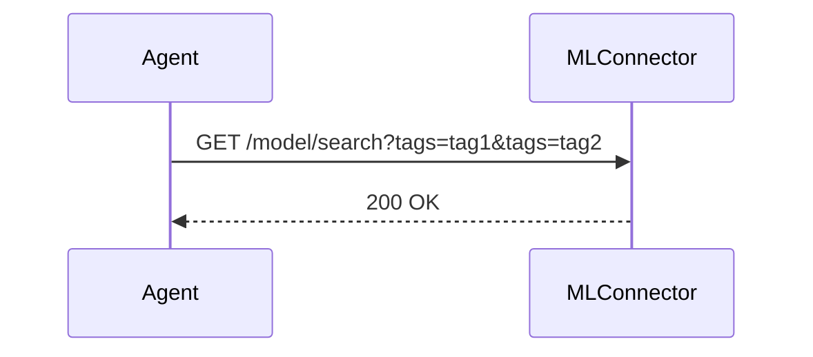

---

### PATCH /model/{model_id}
**Summary:** Update metadata of an existing model.

**Path Parameters:**

| Name     | In   | Type   | Required | Description    |
|----------|------|--------|----------|----------------|
| model_id | path | string | yes      | ID of the model |

> _Note: Request body schema not defined in spec; typically a partial `MLModel` object._

**Responses:**
- **200**: (empty response)
- **422**: `HTTPValidationError`.

**Example cURL:**
```bash
curl -X PATCH "BASE_URL/model/1234" \
     -H "Content-Type: application/json" \
     -d '{
           "modeltags": ["updated-tag"],
           "drift_detection": [{"is_true": 1, "method": 1}]
         }'
```

**Example Python:**
```python
import requests

update = {
    "modeltags": ["updated-tag"],
    "drift_detection": [{"is_true": 1, "method": 1}]
}
resp = requests.patch("BASE_URL/model/1234", json=update)
print(resp.status_code)
```

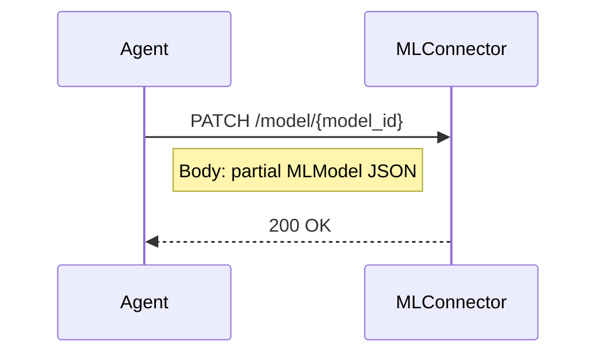

---

### DELETE /model/{model_id}
**Summary:** Delete an existing model.

**Path Parameters:**

| Name     | In   | Type   | Required | Description    |
|----------|------|--------|----------|----------------|
| model_id | path | string | yes      | ID of the model |

**Responses:**
- **200**: (empty response)
- **422**: `HTTPValidationError`.

**Example cURL:**
```bash
curl -X DELETE "BASE_URL/model/1234"
```

**Example Python:**
```python
import requests

resp = requests.delete("BASE_URL/model/1234")
print(resp.status_code)
```

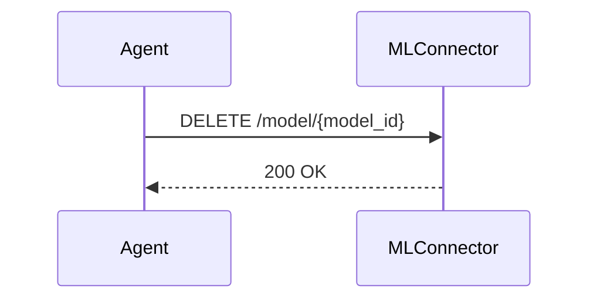

---

## Training Endpoints

### POST /mltraining/add
**Summary:** Initiate model training.

**Request Body (`MLTrainCreate`):**
```json
{
  "modelid": "1234",
  "placement": {
    "clusterID": "*",
    "node": "*",
    "continuum": false
  }
}
```

**Responses:**
- **201**: `MLTrain` object.
- **422**: `HTTPValidationError`.

**Example cURL:**
```bash
curl -X POST "BASE_URL/mltraining/add" \
     -H "Content-Type: application/json" \
     -d '{
           "modelid": "1234",
           "placement": { "clusterID": "*", "node": "*", "continuum": false }
         }'
```

**Example Python:**
```python
import requests

payload = {
    "modelid": "1234",
    "placement": {"clusterID": "*", "node": "*", "continuum": False}
}
resp = requests.post("BASE_URL/mltraining/add", json=payload)
print(resp.json())
```

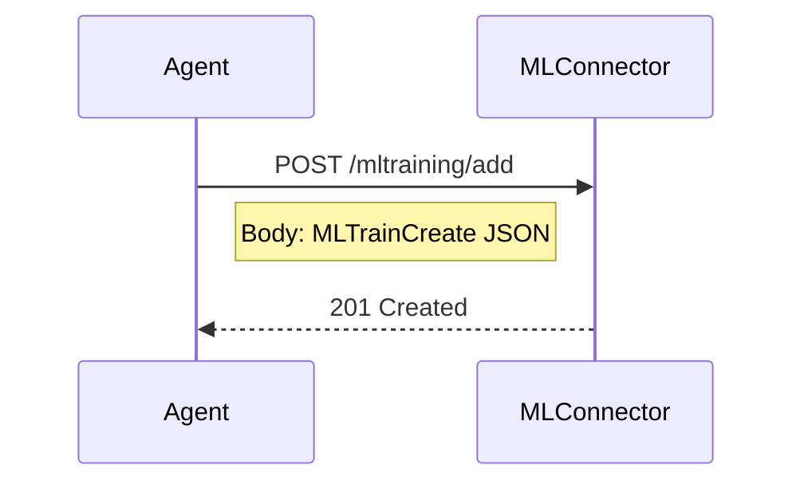

---

## Deployment Endpoints

### GET /deployment/all
**Summary:** Get all deployments.

**Query Parameters:**

| Name  | In    | Type    | Default | Required | Description                 |
|-------|-------|---------|---------|----------|-----------------------------|
| skip  | query | integer | 0       | no       | Number of items to skip     |
| limit | query | integer | 100     | no       | Maximum number of items     |

**Responses:**
- **200**: Array of deployment objects.
- **422**: `HTTPValidationError`.

**Example cURL:**
```bash
curl -X GET "BASE_URL/deployment/all?skip=0&limit=50" \
     -H "Accept: application/json"
```

**Example Python:**
```python
import requests

resp = requests.get(
    "BASE_URL/deployment/all",
    params={"skip": 0, "limit": 50}
)
print(resp.json())
```

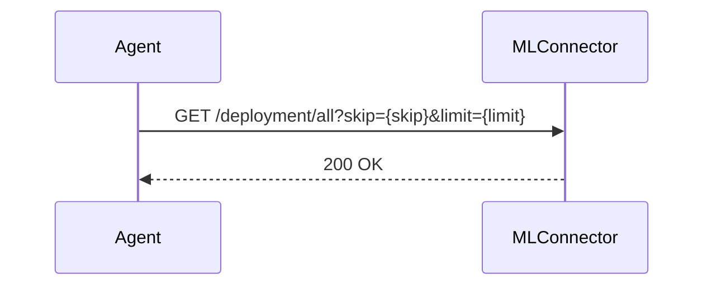

---

### POST /deployment/add
**Summary:** Create a new deployment.

**Request Body (`MLDeploymentCreate`):**
```json
{
  "modelid": "1234",
  "ownerid": "agent-1",
  "placement": { "clusterID": "*", "node": "*", "continuum": true },
  "deployment_id": "dep-5678",
  "inference_data": 1
}
```

**Responses:**
- **201**: `MLDeploymentReturn` object.
- **422**: `HTTPValidationError`.

**Example cURL:**
```bash
curl -X POST "BASE_URL/deployment/add" \
     -H "Content-Type: application/json" \
     -d '{
           "modelid": "1234",
           "ownerid": "agent-1",
           "placement": { "clusterID": "*", "node": "*", "continuum": true },
           "deployment_id": "dep-5678",
           "inference_data": 1
         }'
```

**Example Python:**
```python
import requests

payload = {
    "modelid": "1234",
    "ownerid": "agent-1",
    "placement": {"clusterID": "*", "node": "*", "continuum": True},
    "deployment_id": "dep-5678",
    "inference_data": 1
}
resp = requests.post("BASE_URL/deployment/add", json=payload)
print(resp.json())
```

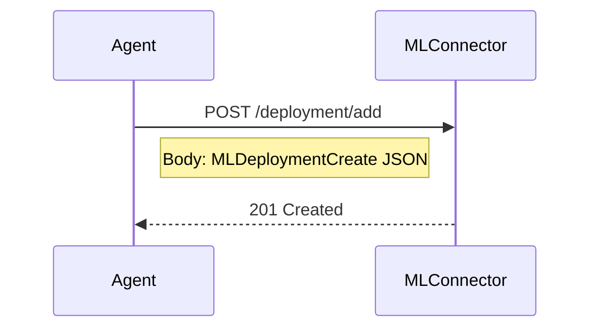

---

### POST /deployment/add/operation
**Summary:** Record an inference operation.

**Request Body (`MLDeploymentOposCreate`):**
```json
{
  "ownerid": "agent-1",
  "deploymentid": "dep-5678",
  "modelid": "1234",
  "data": "{...}",
  "result": "{...}"
}
```

**Responses:**
- **201**: `MLDeploymentOposReturn` object.
- **422**: `HTTPValidationError`.

**Example cURL:**
```bash
curl -X POST "BASE_URL/deployment/add/operation" \
     -H "Content-Type: application/json" \
     -d '{
           "ownerid": "agent-1",
           "deploymentid": "dep-5678",
           "modelid": "1234",
           "data": "{...}",
           "result": "{...}"
         }'
```

**Example Python:**
```python
import requests

payload = {
    "ownerid": "agent-1",
    "deploymentid": "dep-5678",
    "modelid": "1234",
    "data": "{...}",
    "result": "{...}"
}
resp = requests.post("BASE_URL/deployment/add/operation", json=payload)
print(resp.json())
```

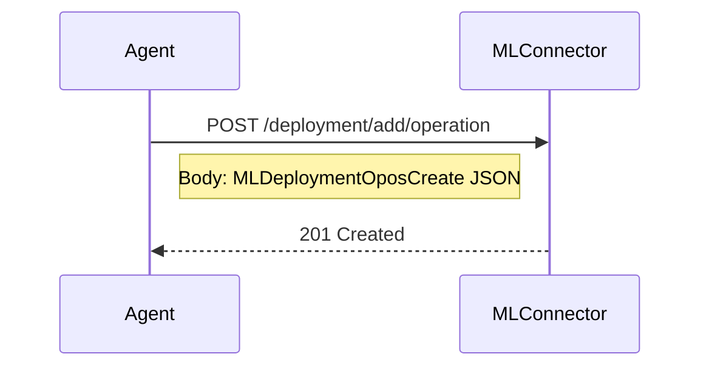

---

### GET /deployment/get/status/{deployment_id}
**Summary:** Retrieve deployment status.

**Path Parameters:**

| Name          | In   | Type   | Required | Description            |
|---------------|------|--------|----------|------------------------|
| deployment_id | path | string | yes      | ID of the deployment   |

**Responses:**
- **200**: Status object.
- **422**: `HTTPValidationError`.

**Example cURL:**
```bash
curl -X GET "BASE_URL/deployment/get/status/dep-5678" \
     -H "Accept: application/json"
```

**Example Python:**
```python
import requests

resp = requests.get("BASE_URL/deployment/get/status/dep-5678")
print(resp.json())
```

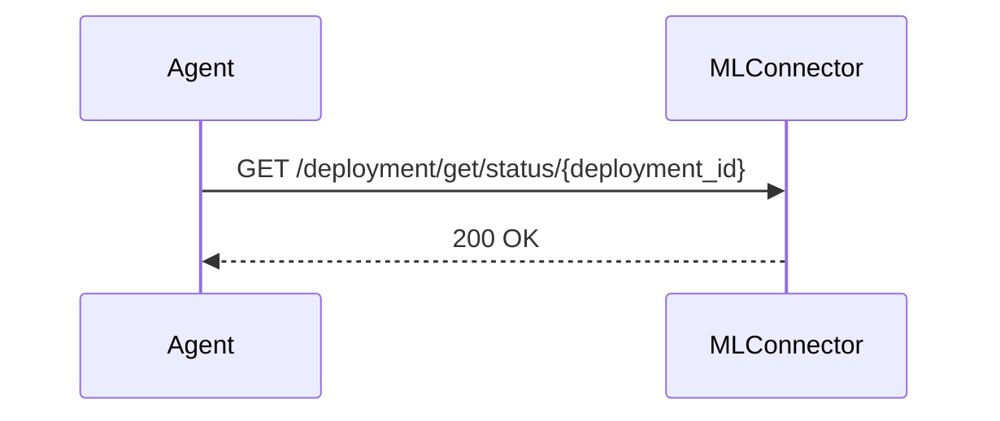

---

### GET /deployment/get/opos/{ownerid}
**Summary:** List operations by owner.

**Path Parameters:**

| Name    | In   | Type   | Required | Description            |
|---------|------|--------|----------|------------------------|
| ownerid | path | string | yes      | ID of the operation's owner |

**Responses:**
- **200**: Array of `MLDeploymentOposReturn` objects.
- **422**: `HTTPValidationError`.

**Example cURL:**
```bash
curl -X GET "BASE_URL/deployment/get/opos/agent-1" \
     -H "Accept: application/json"
```

**Example Python:**
```python
import requests

resp = requests.get("BASE_URL/deployment/get/opos/agent-1")
print(resp.json())
```

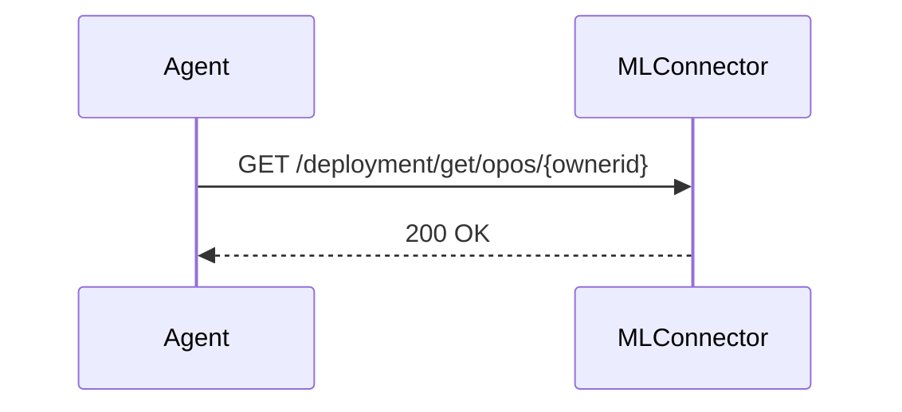

---

### DELETE /deployment/{deployment_id}
**Summary:** Delete a deployment.

**Path Parameters:**

| Name          | In   | Type   | Required | Description            |
|---------------|------|--------|----------|------------------------|
| deployment_id | path | string | yes      | ID of the deployment   |

**Responses:**
- **200**: (empty response)
- **422**: `HTTPValidationError`.

**Example cURL:**
```bash
curl -X DELETE "BASE_URL/deployment/dep-5678"
```

**Example Python:**
```python
import requests

resp = requests.delete("BASE_URL/deployment/dep-5678")
print(resp.status_code)
```

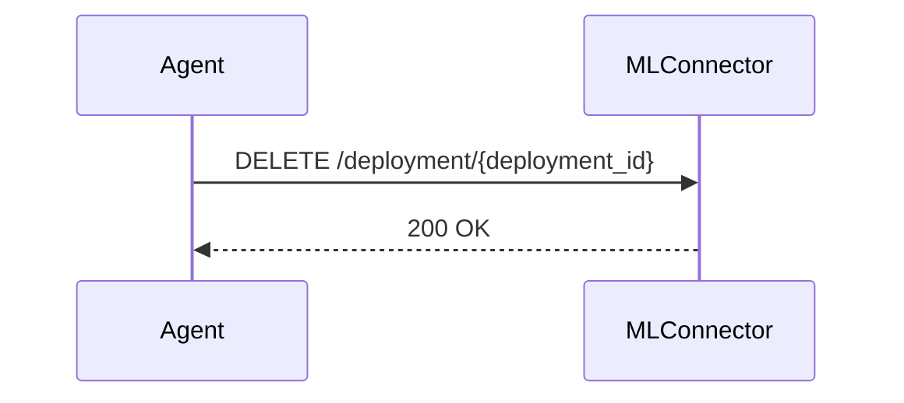


---

# End-to-end example

**Base URL:** `BASE_URL`

## 1. Build and save model
Below, we build a simple regression model using scikit-learn and save it to local storage.

```python
...
# Replace with your training pipeline
reg = Ridge(alpha=1.0, random_state=0)
reg.fit(X, y)
...

# It is important that all models are saved with a .pkl extension
# Serialize  with pickle to a .pkl file
output_path = "diabetes_ridge.pkl"
with open(output_path, "wb") as f:
    pickle.dump(reg, f)

```
## 2. Register ML model with
### 2.1 Model metadata
To register the model above, first we add the model metadata and then the model artfacts. Using the model above, here is json description example (To see what each parameter means see api documentation).
```json
{
  "modelname": "Ridge",
  "modelkind": "Regressor",
  "hyperparameter": [
    {
      "parameter": "string",
      "value": 0
    }
  ],
  "modelperformance": [
    {
      "metric": "Accuracy",
      "order": 1,
      "threshold": 0.89
    }
  ],
  "trainingresource": [
    {
      "resource_name": "GPU",
      "value": 16,
      "deploy": "string"
    }
  ],
  "runresource": [
    {
      "resource_name": "GPU",
      "value": 16,
      "deploy": "string"
    }
  ],
  "featurelist": [...],
  "inference": [
    {
      "type": "string",
      "value": "string"
    }
  ],
"modeltags": [
    "regression",
       "fast"
  ],
"drift_detection": [
    {
      "is_true": 1,
      "method": 0
    }
  ]
}
```
Use the above description, we can then make a post request to register the model. 

```python
import requests
resp = requests.post("BASE_URL/model/add", json=payload)
print(resp.json())
```
### 2.2 Model artifacts
The above step should return a model_id that will be used in the next steps. Here, will upload the model artifacts. These include; 
- Model file (pickled file saved in step one above)
- Training data. This will be used for explainability and drift detection. (Note, it has to be the exact same data used to train the model, otherwise you will get wrong results)
- Requirements file that defines the environment the model was trained in.

Upload these one by one using the example below;
Note: file_kind can be `model`, `data`, `code`, and `env`
```python
import requests

files = {
    "file": open("model.pkl", "rb"),
    "file_kind": (None, "model")
}
resp = requests.post("BASE_URL/model/1234/upload", files=files)
print(resp.json())
```
## 3. Deployment
After adding the model artifacts, the next step is to deploy the model. The ML model is deployed as standalone docker application and an endpoint is returned to which inference data can be passed. 
```python
import requests

payload = {
    "modelid": "1234",
    "ownerid": "agent-1",
    "placement": {..},
    "deployment_id": "",
    "inference_data": 1
}
resp = requests.post("BASE_URL/deployment/add", json=payload)
print(resp.json())
```
`placement` can one of the following; 
- Placement to a specific cluster, node and continuum
```json
{"clusterID": "UTH-Internal-testbed", "node": "mls-drone", "continuum": "Edge"}
```
- Placement on a given cluster
```json
  {"clusterID": "UTH-Internal-testbed", "node": "*", "continuum": "*"}
```
- Placement anywhere
```json
{"clusterID": "*", "node": "*", "continuum": "*"}
```  
This returns a deployment_id used to query the status of the deployment and also the inference endpoint and explainability. 

### 3.1 Query Deployment Status

- **List All**: `GET /deployment/all?skip={skip}&limit={limit}`  
- **Get Status**: `GET /deployment/get/status/{deployment_id}`

**Example:**
```bash
curl -X GET "BASE_URL/deployment/get/status/dep-iris-001"
```
---

## 4. Inference Endpoint (including Explainability)

### 4.1 Predict Call

Assuming deployment created with `deployment_id = dep-iris-001`:

```bash
curl -X POST "BASE_URL/deployment/dep-iris-001/predict" \
     -H "Content-Type: application/json" \
     -d '{
           "data": [[5.1, 3.5, 1.4, 0.2]],
           "explain": true
         }'
```

**Response:**
```json
{
  "prediction": [0],
  "explanation": {
    "feature_importance": [0.12, 0.08, 0.70, 0.10],
    "method": "shap"
  }
}
```

### 4.2 Explainability Details

- When `explain=true`, response includes per-feature contributions (e.g., SHAP values).  
- Interpretation: Positive values push toward the predicted class; negatives push away.  

---
